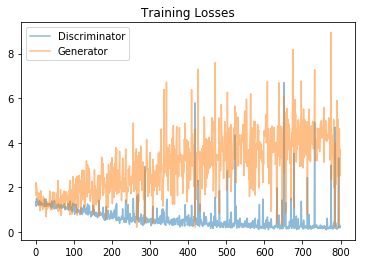

# Project: Face Generation

In this project, I defined and trained a DCGAN on the [CelebFaces Attributes Dataset (CelebA)](https://s3.amazonaws.com/video.udacity-data.com/topher/2018/November/5be7eb6f_processed-celeba-small/processed-celeba-small.zip)..

## Getting Started

In this notebook, I will make the first steps towards developing a DCGAN that could be used to generate "fake"  new images of faces.


### Prerequisites

Things you have to install or installed on your working machine:

* Python 3.7
* Numpy (win-64 v1.15.4)
* Pandas (win-64 v0.23.4)
* Matplotlib (win-64 v3.0.2)
* Jupyter Notebook
* Torchvision (win-64 v0.2.1)
* PyTorch (win-64 v0.4.1)

### Environment:
* [Miniconda](https://conda.io/miniconda.html) or [Anaconda](https://www.anaconda.com/download/)

### Installing

Use the package manager [pip](https://pip.pypa.io/en/stable/) or
[miniconda](https://conda.io/miniconda.html) or [Anaconda](https://www.anaconda.com/download/) to install your packages.  
A step by step guide to install the all necessary components in Anaconda for a Windows-64 System:
```bash
conda install -c conda-forge numpy
conda install -c conda-forge pandas
conda install -c conda-forge matplotlib
pip install torchvision
conda install -c pytorch pytorch
```

## Jupyter Notebook
* `dlnd_face_generation.ipynb.ipynb`

This jupyter notebook describe the whole project from udacity, from the beginning to the end.

## Download the Datasets

To train and test the model, you need this dataset:

* The [CelebFaces Attributes Dataset (CelebA)](https://s3.amazonaws.com/video.udacity-data.com/topher/2018/November/5be7eb6f_processed-celeba-small/processed-celeba-small.zip).
Place it in this project's home directory.


## Running the project

The whole project is located in the file `dlnd_face_generation.ipynb` and it's include the training and the generation part.

### Model architecture

#### Discriminator

I chose a network architecture that consist of a series (here we used 3) Convolutioncal Layer with Batch Normalization Followed by a Leaky Relu Activation function and finally a fully connected output layer.

```python
Discriminator(
  (conv1): Conv2d(3, 32, kernel_size=(4, 4), stride=(2, 2), padding=(1, 1), bias=False)
  (conv2): Conv2d(32, 64, kernel_size=(4, 4), stride=(2, 2), padding=(1, 1), bias=False)
  (batchnorm1): BatchNorm2d(64, eps=1e-05, momentum=0.1, affine=True, track_running_stats=True)
  (conv3): Conv2d(64, 128, kernel_size=(4, 4), stride=(2, 2), padding=(1, 1), bias=False)
  (batchnorm2): BatchNorm2d(128, eps=1e-05, momentum=0.1, affine=True, track_running_stats=True)
  (fc): Linear(in_features=2048, out_features=1, bias=True)
)
```

#### Generator

I chose a network architecture that consist of a fully connected layer followed by a series of (here we used 3) Transpose Convolutioncal Layer with Batch Normalization Followed by a Relu Activation function and finally a TanH activation function on the last layer.

```python
Generator(
  (fc): Linear(in_features=100, out_features=2048, bias=True)
  (d_conv1): ConvTranspose2d(128, 64, kernel_size=(4, 4), stride=(2, 2), padding=(1, 1), bias=False)
  (batchnorm1): BatchNorm2d(64, eps=1e-05, momentum=0.1, affine=True, track_running_stats=True)
  (d_conv2): ConvTranspose2d(64, 32, kernel_size=(4, 4), stride=(2, 2), padding=(1, 1), bias=False)
  (batchnorm2): BatchNorm2d(32, eps=1e-05, momentum=0.1, affine=True, track_running_stats=True)
  (d_conv3): ConvTranspose2d(32, 3, kernel_size=(4, 4), stride=(2, 2), padding=(1, 1), bias=False)
)
```
### Model Hyperparam and Definition
For model parameters
```python
# Define model hyperparams
d_conv_dim = 32
g_conv_dim = 32
z_size = 100
```

Defining the Model
```python
D = Discriminator(d_conv_dim)
G = Generator(z_size=z_size, conv_dim=g_conv_dim)
```

### Loss Function
I calculated the losses for both types of adversarial networks.

For the discriminator, the total loss is the sum of the losses for real and fake images, d_loss = d_real_loss + d_fake_loss.
Remember that we want the discriminator to output 1 for real images and 0 for fake images, so we need to set up the losses to reflect that.

The generator loss will look similar only with flipped labels. The generator's goal is to get the discriminator to think its generated images are real.

We used the BCEWithLogitsLoss (Binary Cross Entropy Loss) loss function

```python
def real_loss(D_out):
    '''Calculates how close discriminator outputs are to being real.
       param, D_out: discriminator logits
       return: real loss'''
    batch_size = D_out.size(0)
    labels = torch.ones(batch_size)
    if train_on_gpu:
        labels = labels.cuda()
    criterion = nn.BCEWithLogitsLoss()
    loss = criterion(D_out.squeeze(), labels)
    return loss

def fake_loss(D_out):
    '''Calculates how close discriminator outputs are to being fake.
       param, D_out: discriminator logits
       return: fake loss'''
    batch_size = D_out.size(0)
    labels = torch.zeros(batch_size)
    if train_on_gpu:
        labels = labels.cuda()
    criterion = nn.BCEWithLogitsLoss()
    loss = criterion(D_out.squeeze(), labels)
    return loss
```

### Optimizer
For optimizers, I used a learning rate of 0.002 and the Adam optimizer

```Python
lr = 0.002
beta1 = 0.5
beta2 = 0.99

# Create optimizers for the discriminator D and generator G
d_optimizer = optim.Adam(D.parameters(), lr, [beta1, beta2])
g_optimizer = optim.Adam(G.parameters(), lr, [beta1, beta2])
```

### Train the model

To train the neural network (RNN), run the file `dlnd_face_generation.ipynb`.


### Output of training

I trained for 100 Epochs



## Improvements

The next steps will be:
* Fine tune the model more and also increase training time.
* Implement and provide this model as an API using flask.
* Revamp and clean up the code
* Implement with different training parameters (lr, optimizer etc)

## Authors

* Musa Joshua

## License
[MIT](https://choosealicense.com/licenses/mit/)
